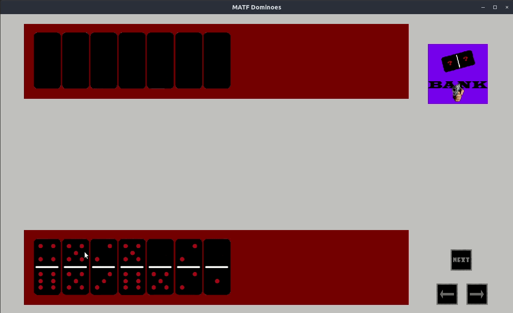

# 2020_Traditional-dominoes-game

[](https://app.codacy.com/gh/matf-pp/2020_Domine?utm_source=github.com&utm_medium=referral&utm_content=matf-pp/2020_Domine&utm_campaign=Badge_Grade_Dashboard)

Implementation of traditional dominoes table game in programming language GO using SDL2 graphics library.

## Prerequisites

Golang: <https://golang.org/doc/install>
SDL2 binding for GO: <https://github.com/veandco/go-sdl2#installation>

## Building  
Clone this repository:
```
git clone https://github.com/matf-pp/2020_Domine.git
```
Position to the folder you cloned and build project:
```
go build
```
And just run it:
```bash
./2020_Domine
```
### :video_game: Gameplay
Click on domino to place it on the table, if there are no dominoes in your deck to match dominoes on table, you can buy one from the bank. If you still did not get the right domino, you can let your opponent play by clicking next button. When there are 2 possible directions domino can go, you can decide which way it goes by clicking on the left :arrow_left: or right arrow :arrow_right: . Player with higher double domino plays first, if neither player has double domino, the one with higher number of dots on one domino plays first. If no dominoes are left in the bank and neither player can place domino, player with less dots in total wins.



#### Authors
-   **Teodora Isailovic**
-   **Stefan Durlevic**
-   **Mihailo Vlajkovic**
